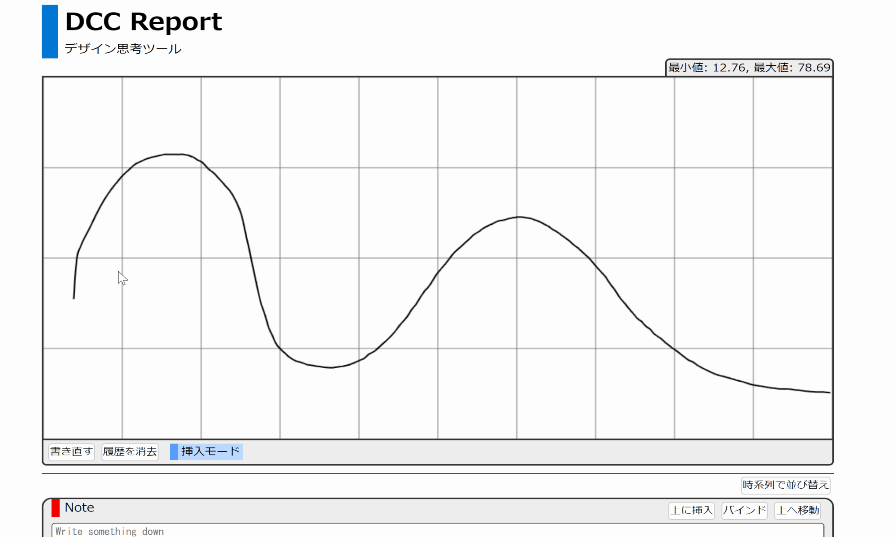

# ユーザーマニュアル

## 概要・目的

発散収束曲線の記録ツールです。
思考の収束・発散をキャンバス上に曲線で表すことができます。
曲線中で重要な点をプロットし、その内容を記述していくことで記録を行います。
また、記述した内容を HTML ファイルとしてダウンロードすることができます。
記録の共有、講義での提出の際にご活用ください。

## クイックスタート

### １．キャンバスに DCC(発散収束曲線)を描く

- 曲線を描画
- 続きから描画可能
- 「書き直し」ボタンでリセット

### ２．曲線上に点を取るとメモ枠が作成

- 曲線をクリックすることでプロット
- 点の番号に対応したメモの自動追加

### ３．メモの記述と並べ替え

- メモの枠にテキストを記述
- 自由に並べ替え・削除が可能
- 右上にある「時系列で並べ替え」で自動ソート

### ４．その他メモの作成

- 追加のメモの作成
- 自由に内容を記述
- 「バインド」による曲線との対応付け

### ５．HTML ファイルをダウンロード

- 記述したページのダウンロード(HTML)

## その他機能説明

### ID・氏名の記述

ID・氏名欄に氏名が記述可能
