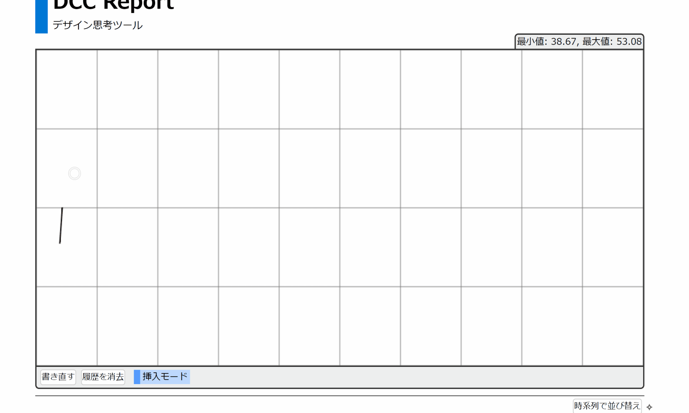

# ユーザーマニュアル

## アプリの概要

本アプリは、アイデアに関する発散収束曲線（DCC）を記録するためのものです。  
経過時間と共に変化する思考の発散と収束を、曲線で表すことができます。
議論中に出た意見を「メモ」として残し、曲線中のある時点と対応付けることができます。
曲線とメモは HTML ファイルとして保存でき、記録の共有や提出に活用できます。

## アプリの使い方

### 1. メモを取る

議論をしながら、重要な意見をメモしておきます。
メモは「新しいメモを追加」ボタンでどんどん書いていけます。

### 2. 発散収束曲線を書く

議論が終わったら、グラフ領域に発散収束曲線を書きます。
曲線は続きからでも書け、「書き直す」ボタンで前の曲線と見比べながら書き直せます。
前の曲線は、「履歴を消去」ボタンで非表示にすることもできます。

### 3. メモと曲線を対応付ける

メモの「バインド」ボタンを押してから曲線に触れると、そのメモと曲線中のある時点を対応付けることができます。
対応付けは、再度同じ操作を行うことで調整できます。

### 4. メモを追加する

必要があれば「上に挿入」ボタンなどでメモを追加し、曲線と対応付けます。
グラフ領域の下部に「挿入モード」と出ていれば、曲線に直接触れることでもメモを追加できます。

各メモは、「上へ移動」ボタンや「下へ移動」ボタンで順番を入れ替えることができます。
また「時系列で並べ替え」ボタンで、曲線中の番号に沿って並び替えることもできます。

### 5. HTML ファイルとして保存する

最下部にある「HTML でダウンロード」ボタンで、曲線やメモなどを HTML ファイルとして保存することができます。
